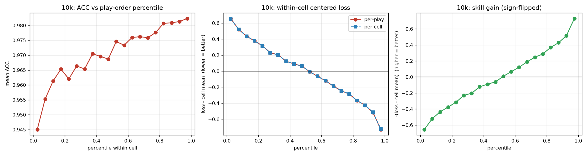
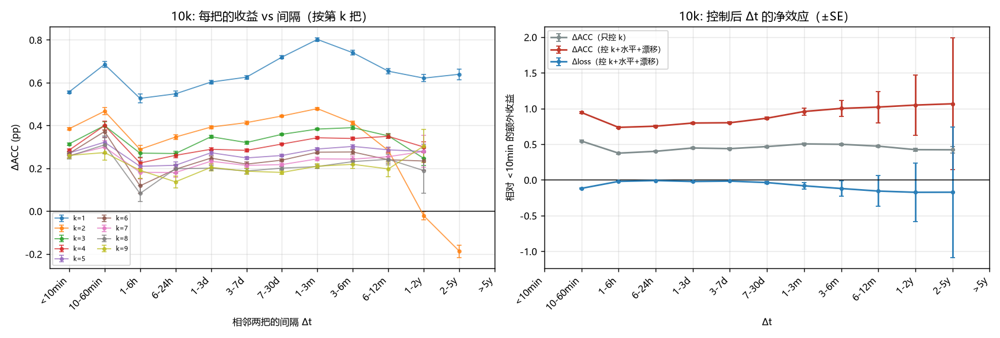

# DenseConstantRegressor

从 osu!mania 4K 游玩记录中学习**谱面难度潜向量**。

Learning **beatmap difficulty vectors** from osu!mania 4K play records.

[中文](#中文) · [English](#english)

---

## 中文

### 简介

把每条游玩记录看成 `(玩家, 谱面) → loss`，先学这个低秩回归，再把学到的**谱面向量**当作难度特征，
用于回归官方 star。数据来自 osu! 官方 [data.ppy.sh](https://data.ppy.sh/) dump 的 osu!mania 4K 成绩。

三步管线，一步一个脚本、一步一个产物：

| 步骤 | 脚本 | 产物 |
|---|---|---|
| **0 预处理** | `scripts/step0_preprocess.py` | play 表（5 列）+ 谱面元数据（17 列） |
| **1 清洗** | `scripts/step1_clean.py` | 清洗后的 play 表 |
| **2 预测** | `scripts/step2_predict.py` | 玩家/谱面潜向量 + 指标 |
| **3 定数回归** | *未实现* | — |

### 快速开始

```bash
pip install -r requirements.txt

# 下载数据（约 14 GB，不入库）
cd data/raw
curl -LO https://data.ppy.sh/2026_09_01_performance_mania_top_1000.tar.bz2
curl -LO https://data.ppy.sh/2026_09_01_performance_mania_top_10000.tar.bz2
tar -xjf 2026_09_01_performance_mania_top_1000.tar.bz2  -C extracted/
tar -xjf 2026_09_01_performance_mania_top_10000.tar.bz2 -C extracted_10k/
cd ../..

# 跑管线
python scripts/step0_preprocess.py \
    --dump-dir data/raw/extracted/2026_09_01_performance_mania_top_1000 --tag 1k
python scripts/step1_clean.py   --tag 1k
python scripts/step2_predict.py --tag 1k --models bias,mf_dot,mirt
```

### 结果速览

测试集为 30% 的 `(玩家, 谱面)` 有序对，指标为 loss 的 RMSE / Spearman：

| 模型 | 1k RMSE | 1k Spearman | 10k RMSE | 10k Spearman |
|---|---|---|---|---|
| bias | 1.5236 | 0.7330 | 1.3727 | 0.6874 |
| mf_dot | 1.4548 | 0.7632 | 1.3327 | 0.7079 |
| **mirt** | **1.4582** | **0.7633** | **1.3331** | **0.7096** |

<p align="center">
  
  
</p>

### 目录结构

```
scripts/   32 个当前脚本 + legacy/ 60 个退役脚本（旧 v2 管线）
docs/      9 篇技术文档 + figs/ 38 张图
logs/      25 份运行日志
data/      仅目录骨架 —— 约 14 GB 实际数据不入库
```

### 文档

| 文档 | 内容 |
|---|---|
| [docs/step0_preprocessing.md](docs/step0_preprocessing.md) | 预处理：dump 结构、mod 策略、标签口径 |
| [docs/step1_cleaning.md](docs/step1_cleaning.md) | 清洗：两条行级删除 |
| [docs/step2_prediction.md](docs/step2_prediction.md) | 预测：模型族、消融、9 条校验 |
| [docs/play_order_analysis.md](docs/play_order_analysis.md) | 学习曲线 |
| [docs/learning_rate_heterogeneity.md](docs/learning_rate_heterogeneity.md) | 学习率异质性 |
| [docs/forgetting_curve.md](docs/forgetting_curve.md) | 遗忘曲线 |
| [docs/practice_vs_time.md](docs/practice_vs_time.md) | 练习 vs 日历时间 |
| [docs/cleaning_plan.md](docs/cleaning_plan.md) | 清洗方案与修订记录 |
| [docs/beatmap_embedding_plan.md](docs/beatmap_embedding_plan.md) | 谱面嵌入规划 |
| [docs/overview.md](docs/overview.md) | **完整技术总览**（含全部实测数字） |

### 说明

* **数据不入库**：原始 dump 与中间产物约 14 GB，只保留 `data/` 目录骨架（`.gitkeep`）。
* **`external/bobert` 不入库**：那是 [token03/bobert](https://github.com/token03/bobert) 的独立克隆，
  需要时自行 `git clone` 到该路径。
* 依赖见 [requirements.txt](requirements.txt)，开发环境 Python 3.13。

### 许可

本仓库未附许可证文件。

---

## English

### Overview

Treat each play as `(player, beatmap) → loss`, fit that low-rank regression first, then use the
learned **beatmap vectors** as difficulty features to regress the official star rating.
Data comes from the official [data.ppy.sh](https://data.ppy.sh/) dumps of osu!mania 4K scores.

Three steps, one script and one artifact each:

| Step | Script | Artifact |
|---|---|---|
| **0 Preprocess** | `scripts/step0_preprocess.py` | play table (5 cols) + beatmap metadata (17 cols) |
| **1 Clean** | `scripts/step1_clean.py` | cleaned play table |
| **2 Predict** | `scripts/step2_predict.py` | player/beatmap latent vectors + metrics |
| **3 Constant regression** | *not implemented* | — |

### Quick start

```bash
pip install -r requirements.txt

# Download the data (~14 GB, not tracked)
cd data/raw
curl -LO https://data.ppy.sh/2026_09_01_performance_mania_top_1000.tar.bz2
curl -LO https://data.ppy.sh/2026_09_01_performance_mania_top_10000.tar.bz2
tar -xjf 2026_09_01_performance_mania_top_1000.tar.bz2  -C extracted/
tar -xjf 2026_09_01_performance_mania_top_10000.tar.bz2 -C extracted_10k/
cd ../..

# Run the pipeline
python scripts/step0_preprocess.py \
    --dump-dir data/raw/extracted/2026_09_01_performance_mania_top_1000 --tag 1k
python scripts/step1_clean.py   --tag 1k
python scripts/step2_predict.py --tag 1k --models bias,mf_dot,mirt
```

### Results at a glance

The test set is 30% of the `(player, beatmap)` ordered pairs; metrics are RMSE / Spearman on loss:

| Model | 1k RMSE | 1k Spearman | 10k RMSE | 10k Spearman |
|---|---|---|---|---|
| bias | 1.5236 | 0.7330 | 1.3727 | 0.6874 |
| mf_dot | 1.4548 | 0.7632 | 1.3327 | 0.7079 |
| **mirt** | **1.4582** | **0.7633** | **1.3331** | **0.7096** |

<p align="center">
  
  
</p>

### Repository layout

```
scripts/   32 current scripts + legacy/ 60 retired scripts (old v2 pipeline)
docs/      9 technical documents + figs/ 38 figures
logs/      25 run logs
data/      directory skeleton only — the ~14 GB of actual data is not tracked
```

### Documentation

| Document | Contents |
|---|---|
| [docs/step0_preprocessing.md](docs/step0_preprocessing.md) | Preprocessing: dump layout, mod policy, label semantics |
| [docs/step1_cleaning.md](docs/step1_cleaning.md) | Cleaning: the two row-level deletions |
| [docs/step2_prediction.md](docs/step2_prediction.md) | Prediction: model family, ablations, the 9 checks |
| [docs/play_order_analysis.md](docs/play_order_analysis.md) | Learning curve |
| [docs/learning_rate_heterogeneity.md](docs/learning_rate_heterogeneity.md) | Learning-rate heterogeneity |
| [docs/forgetting_curve.md](docs/forgetting_curve.md) | Forgetting curve |
| [docs/practice_vs_time.md](docs/practice_vs_time.md) | Practice vs calendar time |
| [docs/cleaning_plan.md](docs/cleaning_plan.md) | Cleaning design and revision record |
| [docs/beatmap_embedding_plan.md](docs/beatmap_embedding_plan.md) | Beatmap embedding plan |
| [docs/overview.md](docs/overview.md) | **Full technical overview** (with every measured number) |

### Notes

* **No data is tracked**: the raw dumps and intermediate artifacts total ~14 GB; only the `data/`
  skeleton is kept (`.gitkeep`).
* **`external/bobert` is not tracked**: it is a standalone clone of
  [token03/bobert](https://github.com/token03/bobert) — `git clone` it there yourself if needed.
* Dependencies are in [requirements.txt](requirements.txt); developed on Python 3.13.

### License

This repository ships no license file.
