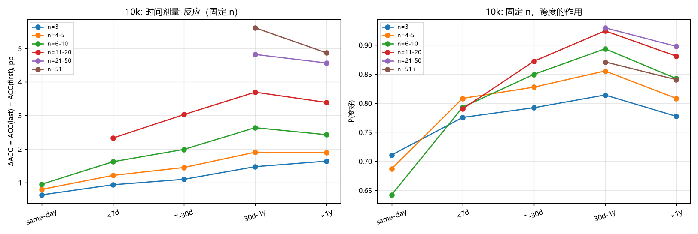
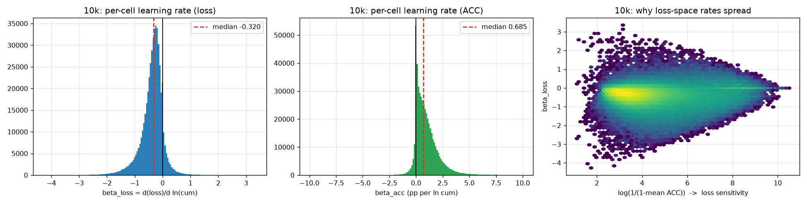

# DenseConstantRegressor

**语言 / Language:** [中文](#中文) · [English](#english)

把一条记录看成 `(玩家, 谱面) -> loss`，先学这个回归，再把学到的**谱面向量**当作难度特征去回归官方 star。
数据源是 osu!mania 4K（官方 data.ppy.sh dump）。

Treat each record as `(player, beatmap) -> loss`, fit that regression first, then use the learned
**beatmap vectors** as difficulty features to regress the official star rating.
Data source: osu!mania 4K (official data.ppy.sh dumps).

> **本仓库只收录代码、文档、图与运行日志。**
> 原始 dump 与全部中间产物（约 14 GB）**不入库** —— 获取方式见[数据获取](#数据获取--getting-the-data)。
>
> **This repository ships code, docs, figures and run logs only.**
> Raw dumps and all intermediate artifacts (~14 GB) are **not tracked** — see
> [Getting the data](#getting-the-data--数据获取).

---

<a id="中文"></a>

# 中文

管线分三步，一步一个脚本、一步一个产物：

| 步骤 | 脚本 | 输入 → 输出 | 技术文档 |
|---|---|---|---|
| **0 预处理** | `scripts/step0_preprocess.py` | 原始 SQL → `step0_{tag}` play 表 + `beatmap_meta_{tag}` | [docs/step0_preprocessing.md](step0_preprocessing.md) |
| **1 清洗** | `scripts/step1_clean.py` | `step0_{tag}` → `step1_{tag}` | [docs/step1_cleaning.md](step1_cleaning.md) |
| **2 预测** | `scripts/step2_predict.py` | `step1_{tag}`（训练）+ `step0_{tag}`（测试）→ 嵌入 + 指标 | [docs/step2_prediction.md](step2_prediction.md) |
| **3 定数回归** | *未实现* | step2 的 `C`/`D` + `beatmap_meta` → 官方 star | — |

> **v2 管线已退役**。2026-10 之前那套（cell 聚合 + 收敛筛选 + NM/DT/HT 速率分档 + 含 NF）的脚本在
> `scripts/legacy/`、产物在 `data/legacy/`。它的规模数字**不能**搬到本版，见 §10。

---

## 0. 目录结构

```
README.md               本文档（中英双语）
.gitignore              排除 14 GB 数据 / 第三方克隆 / 缓存
docs/                   9 篇技术文档 + figs/ 38 张图
logs/                   25 份运行日志（可追溯性）
scripts/                32 个当前脚本
  ├── step0_preprocess.py  step1_clean.py  step2_predict.py   三步主线
  ├── probe_*.py (4)      step0 的取证脚本（mod / NF）
  ├── diag_step2_*.py (15) step2 的可辨识性 / 规范 / 容量诊断
  ├── learning_rate_variance.py  forgetting_curve.py
  ├── play_order_curve.py  practice_vs_time.py  diag_source_order.py
  ├── plot_chart_*.py (2)  画图
  ├── _tmp_*.py (4)        一次性分析草稿
  └── legacy/              60 个旧脚本（v2 建模 / 早期探查 / debug）
data/                   ⚠️ 不入库，只留 .gitkeep 骨架（约 14 GB）
  ├── raw/extracted/        1k dump（13 张 SQL 表）
  ├── raw/extracted_10k/    10k dump（3 张 SQL 表）
  ├── processed/            step0/1/2 + beatmap_meta + 分析产物
  └── legacy/               processed_v2/ + interim/ + interim_10k/
external/               ⚠️ 不入库：token03/bobert 的独立克隆，见 §11
```

**注意**：`data/processed/charts_v2_{1k,10k}_v3.parquet` 与 `data/processed/plays_v2_{1k,10k}_v3.parquet`
虽然属于旧 v2 总体，但仍是 `scripts/learning_rate_variance.py` / `scripts/forgetting_curve.py` /
`scripts/play_order_curve.py` / `scripts/practice_vs_time.py` 的硬依赖，所以刻意留在
`data/processed/`，勿搬。

---

## 1. 数据获取 / Getting the data

仓库不含数据。完整复现需要下载两个官方 dump：

```bash
cd data/raw
curl -LO https://data.ppy.sh/2026_09_01_performance_mania_top_1000.tar.bz2
curl -LO https://data.ppy.sh/2026_09_01_performance_mania_top_10000.tar.bz2
tar -xjf 2026_09_01_performance_mania_top_1000.tar.bz2  -C extracted/
tar -xjf 2026_09_01_performance_mania_top_10000.tar.bz2 -C extracted_10k/
```

解压后目录应为 `data/raw/extracted/2026_09_01_performance_mania_top_1000/`（内含 `osu_*.sql`）。
原始 `.tar.bz2` 在上游流程中已于 2026-10-04 删除，只有解压出的 SQL 参与后续步骤。

### 数据来源

| dump | 表数 | 内容 |
|---|---|---|
| `2026_09_01_performance_mania_top_1000` | **13** | 唯一有 `scores`(modern) + `osu_beatmaps` + `sample_users`（含 username） |
| `2026_09_01_performance_mania_top_10000` | **3** | 只有 legacy：`osu_scores_mania_high` + `osu_user_beatmap_playcount` + `osu_user_stats_mania` |

* **两个 dump 不嵌套**：10k 没有 `osu_beatmaps`，谱面属性一律借 1k；10k 玩家匿名。
* 真 4K mania：`playmode = 3` 且 `diff_size = 4` → **21,949 张谱面**（dump 里 `osu_beatmaps`
  其实含全部四种模式，step0 必须自己筛）。
* **dump 只有通过的游玩**：legacy `rank` enum 无 `'F'`，modern `scores.passed` 全为 1。
  失败/放弃的游玩不留痕；逐次失败位置也不存在（`osu_beatmap_failtimes` 是按谱面聚合的）。
* 时间戳是**秒级**精度（legacy `date` / modern `ended_at`，osu! 服务器时间）。
* 三个 dump 是**同日快照**（2026-09-01）。`random_10000` dump 只有 2 张表、**无任何成绩表**，
  play 级任务不可能，已连同其 `interim` 一起删除。

---

## 2. 标签定义

**经典计分（stable 口径，MAX 与 300 同权）**，并给每条成绩额外加一个伪 "250" 判定
（模拟半个 200 的影响），于是 `1 - ACC` 恒 > 0：

```
ACC = (300*(c300 + cMAX) + 200*c200 + 100*c100 + 50*c50 + 250) / (300 * (总note + 1))
L   = log(1 - ACC)
```

满分成绩的 loss 因此等于 `log(50 / (300*(note+1)))`，随谱面 note 数变化但永不发散。

**符号约定（必须遵守）**：`loss = log(1−ACC) ≤ 0`，是 ACC 的**递减**函数 ——
ACC 越高 → loss 越小（越负）；**「成绩变好」= loss 下降**。
`argmax(loss)` = 最差，`argmin(loss)` = 最好。早期文档的 docstring 把符号写反过，已修正。

---

## 3. 第 0 步：预处理（`scripts/step0_preprocess.py`）

直接读原始 SQL，两遍流式，产出两个文件。

### 3.1 play 表（5 列）

| 列 | 含义 |
|---|---|
| `player_id` | 玩家 id |
| `beatmap_id` | 谱面 id —— **就是「曲目」**，本版没有 rate 维度 |
| `timestamp` | 游玩**结束**时间 `YYYY-MM-DD HH:MM:SS` |
| `playcount_cur` | **cell 内按 `(timestamp, score_id)` 排序的 1-based 序号** |
| `loss` | 见 §2 |

一条游玩一行，**不做任何 cell 级筛选**（乱打 / playcount≤2 / n_scores≤2 全部留给第 1 步）。

`playcount_cur` 是**「包括这一次、此前有多少次成功记录」**，整数、不 join playcount 表、不折算。
它是**下界**：记录覆盖率只有真实游玩次数的约 1/3（中位 0.286）。

### 3.2 mod 策略（两段式）

| 阶段 | 参数 | 默认值 | 行为 |
|---|---|---|---|
| 中性化 | `--neutral-mods` | `MR,SD,PF` | 直接**赋值为未开启**（canonicalize） |
| 白名单 | `--mod-whitelist` | `CL` | 规范化后只允许这些 |

* `MR`/`SD`/`PF` 不改判定权重（不改 ACC）；`SD`/`PF` 只是把手动重开自动化，而手动重开不留痕
  → `CL+PF` 与 `CL` 是同一种观测。
* **`NF` 直接拒绝**（`REJECTED_CHART_NEUTRAL_MODS`，有 startup leak guard）：它让本会 fail 的
  游玩变成记录，是 CL 桶里没有对应物的**新增**行。
* legacy `enabled_mods` 解码：**PF 存成 `SD|PF` = 16416**（16384 单独出现 0 次）→ 有 PF 就丢掉 SD；
  **未命名 bit 必须 fail closed**。
* **modern 表不总写出 `CL`**：1k 的 4K 行里 100,163 / 1,531,094 无 `CL`，且这些行**全部**
  `legacy_score_id = NULL`（lazer ScoreV2）→ `CL` 存在 ⟺ 走 classic 管线 ⟺ legacy 表会有它。
  所以 **modern `mods=[]` ≠ legacy `enabled_mods=0`**。

排序键 `(user_id, beatmap_id, ts, score_id)`；输出用 `.part` 临时文件 + `replace` 原子写。
运行时会打印**两份** per-mod 明细，canonicalize 后必须只剩 `CL` 100.000%。

### 3.3 实测（NF 排除后）

| | 1k | 10k |
|---|---|---|
| 文件 | `data/processed/step0_1k.csv` | `data/processed/step0_10k.parquet` |
| 行数 | 1,399,615 | 13,359,355 |
| 玩家 / 谱面 | 990 / 20,655 | 9,812 / 21,899 |
| cells | 866,616 | 7,784,519 |
| 单记录 cell | 74.12% | 72.47% |
| loss 均值 / sd | −5.6457 / 2.1435 | −4.7708 / 1.8800 |
| loss 范围 | [−12.4663, −0.2669] | [−12.4663, −0.1358] |
| `playcount_cur` 均值 / 中位 / max | 2.253 / 1 / 125 | 2.629 / 1 / 527 |
| 时间范围 | 2013-02-14 … 2026-08-31 | 2013-02-14 … 2026-08-31 |

### 3.4 beatmap metadata 表

`data/processed/beatmap_meta_1k.csv`，**21,949 行 × 17 列**，键 `beatmap_id`，行 = 4K mania 白名单。

列：`beatmap_id, beatmapset_id, mapper_id, version, star, bpm, max_combo, count_total,
diff_overall(OD), diff_drain(HP), hit_length, total_length, playcount, passcount, approved,
last_update, checksum`。

**纯投影**（只读 `osu_beatmaps`，不派生、不 join）；`approved` 原样输出不映射；
`star` 是**无 mod** star。⚠️ 187 个谱面 `version` 含逗号，必须 `parse_careful`。
`star`/`playcount` 是 2026-09-01 快照，却贴在 2013 年起的游玩上。
`data/processed/beatmap_meta_10k.csv` 与 1k **md5 相同**（10k dump 无该表，两边都读 1k）。

---

## 4. 第 1 步：清洗（`scripts/step1_clean.py`）

**只做两条行级删除**，产出 `step1_{tag}.csv`（+ `.parquet` + `.json`）。**顺序：先 ACC，后时间。**

1. **删 ACC ≤ 0.90**：等价 `loss >= log(0.10) = −2.302585092994046`（严格边界，保留 `loss < log(0.1)`）。
   注意这是**逐条游玩**的 ACC，不是 cell 中位 ACC。
2. **删每玩家最早的 `floor(0.3·n)` 条**：`n` = 该玩家在规则一之后的**行数**。
   `floor` → `n ≤ 3` 的玩家一条不删。排序键 `(player_id, timestamp, beatmap_id, playcount_cur)`。

**不重算 `playcount_cur`**（保留原值 → 出现空洞，可追溯删了哪些行）；**不做** cell 聚合 /
attempts / n_scores / 收敛 / 权重 / rate。所以 **`step1_{tag}` 不是训练集**，是清洗后的 play 表。
输出列/格式/`float32` 与 step0 完全一致；9 项 post-condition（最强的是
`output_rows_are_unmodified_input_rows`，靠原行号 `take` 回比）。

### 4.1 实测

| | 1k | 10k |
|---|---|---|
| step0 行数 | 1,399,615 | 13,359,355 |
| − 规则一（ACC） | −22,517 | −338,041 |
| − 规则二（最早 30%） | −412,681 | −3,901,990 |
| **step1 行数** | **964,417**（68.91%） | **9,119,324**（68.26%） |
| 玩家 / 谱面 | 990 / 20,376 | 9,793 / 21,899 |
| cells | 577,999 | 5,145,934 |
| 单记录 cell | 71.51% | 69.59% |
| ACC 最小值 | 0.9000000032 | 0.9000000032 |
| 耗时 / 体积 | 16.3 s / 48.4 MB | 135.9 s / 459.3 MB |

10k 有 19 人被规则一全删（9,812 → 9,793）。**顺序影响很小但方向明确**：先筛 ACC 比先砍时间
少 0.43%（1k）/ 0.75%（10k）。

---

## 5. 第 2 步：预测（`scripts/step2_predict.py`）

预测 `loss`：`(player_id, beatmap_id) -> loss` 的低秩潜向量回归。

### 5.1 口径

* **观测单位只有 play**。没有 cell 表、不取中位、不做任何聚合、无噪声权重。
* **训练读 `step1`（清洗后），测试读 `step0`（未清洗）**。step1 是**训练侧处理**，
  拿它去筛测试集等于条件在处理上（[docs/cleaning_plan.md](cleaning_plan.md) §3.2）。
* **切分**：固定 seed `20260928`，随机取 30% 的 `(player_id, beatmap_id)` **有序对**作测试集，
  其余对供训练。一个对绝不会同时出现在两边 → 每个测试对在训练里都是未见过的。
* 指标 RMSE / MAE / pp / Spearman / 覆盖率。**不用 SE / excess / R²**。

### 5.2 模型族

```
L_hat = b0 + bu[u] + bm[m] + interaction
  bias    : interaction = 0
  mf_dot  : interaction = <P[u], C[m]>
  mirt    : interaction = <P[u] - C[m], D[m]>
```

* `--features F1` 追加 `w1 * ln(playcount_cur)`（直接用 step1 原有的列，没有额外的 `seq` 概念）。
* `--features F2` / `--entity player-year` 额外启用
  `P_eff = P[e] + (tau - 0.5) * V[e]`，`e = (player_id, 自然年)`，`tau = dayofyear/365`。
  **F2 默认关闭**（保留开关）。
* `--p-drift logpc`：玩家侧加**漂移速率向量** `Pc`，`P_eff = P[u] + Pc[u]·ln(playcount_cur)`（初始 0，
  与 F1 的标量可叠加）。
* `--d-constraint nonneg|simplex`：`D = softplus(Z)` / `D = softmax(Z)`。后者**精确**给出
  `D ≥ 0` 且 `Σ_i D_i = 1`（校验项 10 实测 `max|ΣD−1| ≈ 2e-7`）；约束开启时 logits **默认不进
  weight decay**（`--d-logit-wd`，否则 Adam 的 wd 会把 D 拉回均匀的对称点），logits 初始化
  `std=0.5` 破对称。
* `--models mirt_exp`：第三种交互，把每维漏失先在 **(1−ACC) 空间**加权求和再取 log：
  `ℓ̂ = b0 + ln Σ_i D_mi·e^(−(P_ui − C_mi))`（= `ln Σ D e^(−S)`，log-sum-exp / 瓶颈型）。
  比 `mirt` 的 `⟨P−C, D⟩`（加权和型）**更紧、方差更大**，1k 上四个格子都差 ~2.7%（§5.3）。
  只有 `E = D ⊙ e^C` 可辨识；`D` 强制为正（softplus），logits 不进 wd。
* `D` 的单纯形约束（`--d-constraint simplex`）实测过、**最终不采用**（用户拍板）；开关保留。
* **主效应消融**（`--drop-bias u|m|both`）：`b_m` 在 `mirt` 里完全可去（1.4577 vs 1.4582，与 `−C·D` 共线）；
  `b_u` 去不得（+3.3%）；`mirt_exp` 里两个几乎都能去（F0 +1.0%，F1+Pc 反而 −0.4% 到 1.4560）。
  纯常数基线 2.1699。
* **维度消融**（`--dim`，step0 RMSE）：`mirt` F0 — dim2 1.4782 / dim4 1.4652 / **dim8 1.4582** / dim16 1.4582 /
  dim32 1.4585；`mirt` F1+Pc — dim4 1.4297 / **dim8 1.4216** / dim16 1.4225。训练误差一路降到 0.92，
  测试误差 dim 8 就停 → **1k 用 dim 8 就够**（同精度、参数减半）。10k 未扫。
* **不可辨识性**：`mirt` 里只有 `C·D` 与 `D` 可识别，`C` 本身有 `(dim−1)` 维规范自由度 → 必须同时输出 `C` 和 `D`。

**torch 实现**：参数是 `nn.Parameter`，反向走 autograd、优化器 `torch.optim.Adam`；
`--device auto`（有 CUDA 用 CUDA，否则 CPU）、`--threads` 可钉线程数。初始化与 batch 顺序仍用
numpy 的 `default_rng(seed)`，与退役的手写 numpy 实现（`scripts/legacy/step2_predict_numpy.py`）
**逐位相同初值**（实测前向差 2e-9 / 梯度 5e-7）。每次运行跑 `docs/step2_prediction.md` §10 的
9 条校验，任一条失败则不写任何产物（结果同时记进 summary 的 `checks`）。

### 5.3 实测（60 epoch，dim=16，wd=1e-4）

**1k**：对 866,616 → 测试对 259,500（29.94%）；训练 674,436 条 play；测试 420,401 条 play；
覆盖率 99.63%（987 实体 / 19,636 谱面）。

| 模型 | step0 RMSE | step0 Spearman | step1 RMSE |
|---|---|---|---|
| bias | 1.5236 | 0.7330 | 1.1988 |
| mf_dot | 1.4548 | 0.7632 | 1.0126 |
| **mirt** | **1.4582** | **0.7633** | **1.0087** |

消融：`F1` 1.4290（−2.0%）；`F2` 1.0886 但覆盖率掉到 **83.76%**（不可直接比）；
`--pair-universe step1` 1.1106（测试集被清洗筛过 → 更容易）。**`mf_dot ≈ mirt`。**

**10k**：对 7,784,519 → 测试对 2,334,078（29.98%）；训练 6,384,278；测试 4,007,074；
覆盖率 **100.00%**（9,776 实体 / 21,870 谱面）。

| 模型 | step0 RMSE | step0 Spearman | step1 RMSE |
|---|---|---|---|
| bias | 1.3727 | 0.6874 | 1.1511 |
| mf_dot | 1.3327 | 0.7079 | 1.0761 |
| **mirt** | **1.3331** | **0.7096** | **1.0444** |

**机制消融（1k，60 epoch，step0 RMSE）**：

| 模型 | F0 | F0 + Pc 漂移 | F1 | F1 + Pc 漂移 |
|---|---|---|---|---|
| `mirt`（`⟨P−C, D⟩`） | **1.4582** | **1.4363** | **1.4290** | **1.4225** |
| `mirt_exp`（`ln Σ D·e^(−S)`） | 1.5012 | 1.4739 | 1.4695 | 1.4614 |

* **Pc 漂移**（`--p-drift logpc`，`P_eff = P + Pc·ln(playcount_cur)`）：两种交互都值钱
  （−0.45% ~ −1.8%），叠加 F1 后 **1.4225** 是 1k 目前最好。
* **`mirt_exp`**：四个格子都差 ~2.7%，但**训练 RMSE 更低**（0.907 vs 0.922）、清洗后的 step1 口径
  几乎打平 → 差距来自方差而非拟合，主口径仍用 `mirt`。
* `D` 的单纯形约束（单独 +1.0%、叠加漂移 +0.15%）**最终不采用**（用户拍板）。
  详见 [docs/step2_prediction.md](step2_prediction.md) §4.4 / §4.5 / §7。

### 5.4 产物

`data/processed/step2_{tag}_{model}_{features}[_py][_ustep1]_{target}.npz`
（含 `C` / `D` / `P` 等嵌入）+ 累积式 `step2_{tag}_summary_{target}.json`（写在 `runs[variant]`）。

⚠️ **性能要点（复用）**：只把**模型真正用到的参数**交给 Adam（`bias` 不碰 `P`/`C`/`D`）；
嵌入梯度是稠密张量、由 autograd 的 `index_add` 累积，不需要手写 backward 或稀疏技巧。
10k 需要 `--batch 32768`。旧的手写 numpy 版（10k 3 模型 19 min）已退役，见
`scripts/legacy/step2_predict_numpy.py`。

---

## 6. 第 3 步：定数回归（未实现）

用 step2 学到的 `C`/`D`（+ `beatmap_meta`）回归官方 `star`。
**边界：step2 标签 = `loss`（可观测行为）；step3 标签 = `star`（谱面属性）。**

---

## 7. 复现

```bash
PY=python     # 或你的解释器路径 / or your interpreter path

# 1. 第 0 步
$PY scripts/step0_preprocess.py \
    --dump-dir data/raw/extracted/2026_09_01_performance_mania_top_1000 --tag 1k
$PY scripts/step0_preprocess.py \
    --dump-dir data/raw/extracted_10k/2026_09_01_performance_mania_top_10000 \
    --beatmap-src data/raw/extracted/2026_09_01_performance_mania_top_1000 \
    --tag 10k --out data/processed/step0_10k.parquet

# 2. 第 1 步
$PY scripts/step1_clean.py --tag 1k
$PY scripts/step1_clean.py --tag 10k

# 3. 第 2 步
$PY scripts/step2_predict.py --tag 1k  --models bias,mf_dot,mirt
$PY scripts/step2_predict.py --tag 10k --models bias,mf_dot,mirt --batch 32768
```

依赖见 [`requirements.txt`](requirements.txt)。

---

## 8. 分析结论（详见 docs/）

| 主题 | 结论 | 文档 |
|---|---|---|
| 学习曲线 | cell 内 ΔACC ≈ **0.0134·ln(n)**，60–100 次饱和；10k 89% cell 在进步（1k 78%） | [docs/play_order_analysis.md](play_order_analysis.md) |
| 学习率异质性 | `beta_loss = d(loss)/d ln(cum)` 均值 **−0.377**；方差：**玩家 46% / 谱面 13% / 交互 41%**；谱面元数据只解释 **2%** | [docs/learning_rate_heterogeneity.md](learning_rate_heterogeneity.md) |
| 遗忘 | **1h–2y 无遗忘**。「旧练习影响小」是**凹性**（边际 ∝ 1/j），不是衰减；要「最近性」用 `Δt_prev<10min` 指示 | [docs/forgetting_curve.md](forgetting_curve.md) |
| 练习 vs 时间 | **练习 ≈80–90%**，日历漂移 10–20%（cell 内 γ≈0.146±0.045 pp/年）；冷启动首把 ≈1.0–1.1 pp/年（视奏） | [docs/practice_vs_time.md](practice_vs_time.md) |
| 清洗方案 | 判据修订与 1k 实验矩阵 | [docs/cleaning_plan.md](cleaning_plan.md) |
| 谱面嵌入（规划） | 引入 token03/bobert 预训练编码器 | [docs/beatmap_embedding_plan.md](beatmap_embedding_plan.md) |

<p align="center">
  
  
  
  
</p>

⚠️ 这些分析的**总体**是旧 v2（含 NM/DT/HT 分档 + NF），规模数字不能与 §3–§5 混用。

---

## 9. 已知缺失与局限

1. **无失败/放弃游玩**（legacy `rank` enum 无 `'F'`；modern `passed` 全 1）。
2. **无逐次失败位置**（failtimes 按谱面聚合）。
3. **`playcount_cur` 是下界**（只数已记录的成功游玩，覆盖率 ≈28.6%）。
4. modern 的 `preserve=1 AND ranked=1` 过滤掉一批已提交成绩，**排除量无法量化**。
5. **10k 无 modern 源、无谱面属性**（借 1k）、**玩家匿名**。
6. **mod 信息被折叠**（play 表无 mod 列）；**NF 已整体剔除**。

---

## 10. 历史：v2 管线（已退役）

2026-10-04 重整时归档：

* **脚本** → `scripts/legacy/`（60 个）：`scripts/legacy/build_v2.py`、
  `scripts/legacy/convergence_filter.py`、`scripts/legacy/train_stage1*.py`、
  `scripts/legacy/stage2*.py`、`scripts/legacy/parse_dump.py`、
  `scripts/legacy/build_dataset*.py` 等。
* **产物** → `data/legacy/processed_v2/`（2.9 G）：`charts_v2_*`、`plays_4k*`、`cells_*`、
  `stage1_*`、`conv*`、`dim*`、`matrix_n*` 等。
* **中间表** → `data/legacy/interim/`、`data/legacy/interim_10k/`（2.0 G）。

v2 与 v3 的**实质差别**：

| | v2 | 本版（step0/1/2） |
|---|---|---|
| 观测单位 | cell（取中位） | **play** |
| 速率档 | NM / DT / HT 三个独立 chart_id | 无 —— 只留 1.0× classic |
| NF | **保留** | **剔除** |
| 标签 | 多种聚合（median/max/mean/min） | 单一 `loss` |
| 清洗 | 收敛筛选（n/span/delta/se 分层） | 两条行级删除 |
| 划分 | cell 级 10% 留出 | **有序对**随机 30% |

v2 的关键数字（如 1k mirt RMSE 0.9332、10k 1.0605）**不可搬用**。
v2 的结论修正记录（ACC 口径、速率共享、DT 是否只含 1.5×）见
[docs/cleaning_plan.md](cleaning_plan.md)。

---

## 11. 参考资料

* **[token03/bobert](https://github.com/token03/bobert)** — osu!standard 谱面预训练编码器，
  [docs/beatmap_embedding_plan.md](beatmap_embedding_plan.md) 规划引入。
  本仓库**不 vendor** 它（见 `.gitignore`）；需要时：

  ```bash
  git clone https://github.com/token03/bobert external/bobert
  ```

* 原始数据 — <https://data.ppy.sh/>

---

## 12. 许可 / License

本仓库未附许可证文件。如需指定授权条款请补充 `LICENSE`。
上游 osu! 数据的条款以 [data.ppy.sh](https://data.ppy.sh/) 与 osu! 官方说明为准。

---
---

<a id="english"></a>

# English

The pipeline is three steps — one script and one artifact each:

| Step | Script | Input → Output | Technical doc |
|---|---|---|---|
| **0 Preprocess** | `scripts/step0_preprocess.py` | raw SQL → `step0_{tag}` play table + `beatmap_meta_{tag}` | [docs/step0_preprocessing.md](step0_preprocessing.md) |
| **1 Clean** | `scripts/step1_clean.py` | `step0_{tag}` → `step1_{tag}` | [docs/step1_cleaning.md](step1_cleaning.md) |
| **2 Predict** | `scripts/step2_predict.py` | `step1_{tag}` (train) + `step0_{tag}` (test) → embeddings + metrics | [docs/step2_prediction.md](step2_prediction.md) |
| **3 Constant regression** | *not implemented* | step2 `C`/`D` + `beatmap_meta` → official star | — |

> **The v2 pipeline is retired.** The pre-2026-10 stack (cell aggregation + convergence filtering +
> separate NM/DT/HT rate buckets + NF included) lives in `scripts/legacy/` with artifacts under
> `data/legacy/`. **None of its scale numbers carry over** to this version — see §10.

---

## 0. Repository layout

```
README.md               this document (bilingual)
.gitignore              excludes the 14 GB data, third-party clones, caches
docs/                   9 technical documents + figs/ 38 figures
logs/                   25 run logs (traceability)
scripts/                32 current scripts
  ├── step0_preprocess.py  step1_clean.py  step2_predict.py   the three-step spine
  ├── probe_*.py (4)      step0 forensics (mods / NF)
  ├── diag_step2_*.py (15) step2 identifiability / gauge / capacity diagnostics
  ├── learning_rate_variance.py  forgetting_curve.py
  ├── play_order_curve.py  practice_vs_time.py  diag_source_order.py
  ├── plot_chart_*.py (2)  plotting
  ├── _tmp_*.py (4)        one-off analysis scratch
  └── legacy/              60 old scripts (v2 modelling / early probes / debug)
data/                   ⚠️ NOT tracked, only a .gitkeep skeleton (~14 GB)
  ├── raw/extracted/        1k dump (13 SQL tables)
  ├── raw/extracted_10k/    10k dump (3 SQL tables)
  ├── processed/            step0/1/2 + beatmap_meta + analysis artifacts
  └── legacy/               processed_v2/ + interim/ + interim_10k/
external/               ⚠️ NOT tracked: standalone clone of token03/bobert, see §11
```

**Note**: `data/processed/charts_v2_{1k,10k}_v3.parquet` and
`data/processed/plays_v2_{1k,10k}_v3.parquet` belong to the old v2 population, but are still hard
dependencies of `scripts/learning_rate_variance.py`, `scripts/forgetting_curve.py`,
`scripts/play_order_curve.py` and `scripts/practice_vs_time.py` — they are deliberately kept in
`data/processed/`. Do not move them.

---

## 1. Getting the data

The repository ships no data. A full reproduction needs both official dumps:

```bash
cd data/raw
curl -LO https://data.ppy.sh/2026_09_01_performance_mania_top_1000.tar.bz2
curl -LO https://data.ppy.sh/2026_09_01_performance_mania_top_10000.tar.bz2
tar -xjf 2026_09_01_performance_mania_top_1000.tar.bz2  -C extracted/
tar -xjf 2026_09_01_performance_mania_top_10000.tar.bz2 -C extracted_10k/
```

The extracted layout must be `data/raw/extracted/2026_09_01_performance_mania_top_1000/`
(containing `osu_*.sql`). The original `.tar.bz2` archives were deleted upstream on 2026-10-04;
only the extracted SQL feeds the downstream steps.

### Provenance

| dump | tables | contents |
|---|---|---|
| `2026_09_01_performance_mania_top_1000` | **13** | the only one with `scores` (modern) + `osu_beatmaps` + `sample_users` (with usernames) |
| `2026_09_01_performance_mania_top_10000` | **3** | legacy only: `osu_scores_mania_high` + `osu_user_beatmap_playcount` + `osu_user_stats_mania` |

* **The two dumps do not nest**: the 10k dump has no `osu_beatmaps`, so beatmap attributes are always
  borrowed from the 1k dump; 10k players are anonymous.
* True 4K mania: `playmode = 3` and `diff_size = 4` → **21,949 beatmaps** (the dump's
  `osu_beatmaps` actually contains all four modes, so step0 must filter).
* **The dumps only contain passed plays**: the legacy `rank` enum has no `'F'`, and modern
  `scores.passed` is always 1. Failed/aborted plays leave no trace, and per-attempt failure
  positions do not exist either (`osu_beatmap_failtimes` is aggregated per beatmap).
* Timestamps have **second** precision (legacy `date` / modern `ended_at`, osu! server time).
* All three dumps are a **same-day snapshot** (2026-09-01). The `random_10000` dump had only 2 tables
  and **no score table at all**, making play-level work impossible; it was deleted along with its
  `interim`.

---

## 2. Label definition

**Classic scoring (stable semantics, MAX weighted the same as 300)**, plus one extra pseudo-"250"
judgement per score (mimicking the effect of half a 200), so that `1 - ACC` is always > 0:

```
ACC = (300*(c300 + cMAX) + 200*c200 + 100*c100 + 50*c50 + 250) / (300 * (n_notes + 1))
L   = log(1 - ACC)
```

A perfect score therefore has loss `log(50 / (300*(note+1)))` — it varies with the beatmap's note
count but never diverges.

**Sign convention (mandatory)**: `loss = log(1−ACC) ≤ 0` is a **decreasing** function of ACC —
higher ACC → smaller (more negative) loss; **"playing better" = loss goes down**.
`argmax(loss)` = worst, `argmin(loss)` = best. Early docstrings had the sign flipped; that is fixed.

---

## 3. Step 0: preprocessing (`scripts/step0_preprocess.py`)

Reads the raw SQL directly, two streaming passes, producing two files.

### 3.1 The play table (5 columns)

| Column | Meaning |
|---|---|
| `player_id` | player id |
| `beatmap_id` | beatmap id — **this is the "chart"**; there is no rate dimension in this version |
| `timestamp` | play **end** time, `YYYY-MM-DD HH:MM:SS` |
| `playcount_cur` | **1-based index within the cell, ordered by `(timestamp, score_id)`** |
| `loss` | see §2 |

One row per play, with **no cell-level filtering whatsoever** (mashing / playcount≤2 / n_scores≤2 are
all deferred to step 1).

`playcount_cur` answers **"including this one, how many successful records came before"** — it is an
integer, it does not join the playcount table, and it is not rescaled. It is a **lower bound**: record
coverage is only about 1/3 of true play counts (median 0.286).

### 3.2 Mod policy (two stages)

| Stage | Flag | Default | Behaviour |
|---|---|---|---|
| Neutralise | `--neutral-mods` | `MR,SD,PF` | **forced to off** (canonicalise) |
| Whitelist | `--mod-whitelist` | `CL` | after canonicalisation, only these survive |

* `MR`/`SD`/`PF` do not change judgement weights (they do not change ACC); `SD`/`PF` merely
  automate a manual restart, and manual restarts leave no trace → `CL+PF` and `CL` are the same
  observation.
* **`NF` is rejected outright** (`REJECTED_CHART_NEUTRAL_MODS`, with a startup leak guard): it turns
  plays that would have failed into records, i.e. **new** rows with no counterpart in the CL bucket.
* Legacy `enabled_mods` decoding: **PF is stored as `SD|PF` = 16416** (16384 alone occurs 0 times)
  → if PF is present, drop SD; **unnamed bits must fail closed**.
* **The modern table does not always write `CL`**: among the 1k 4K rows, 100,163 / 1,531,094 lack
  `CL`, and those rows **all** have `legacy_score_id = NULL` (lazer ScoreV2) → `CL` present ⟺
  classic pipeline ⟺ the legacy table would have it. So **modern `mods=[]` ≠ legacy `enabled_mods=0`**.

Sort key `(user_id, beatmap_id, ts, score_id)`; output uses a `.part` temp file + `replace` for an
atomic write. The run prints **two** per-mod breakdowns, and after canonicalisation only `CL`
100.000% may remain.

### 3.3 Measured (after NF exclusion)

| | 1k | 10k |
|---|---|---|
| File | `data/processed/step0_1k.csv` | `data/processed/step0_10k.parquet` |
| Rows | 1,399,615 | 13,359,355 |
| Players / beatmaps | 990 / 20,655 | 9,812 / 21,899 |
| Cells | 866,616 | 7,784,519 |
| Single-record cells | 74.12% | 72.47% |
| loss mean / sd | −5.6457 / 2.1435 | −4.7708 / 1.8800 |
| loss range | [−12.4663, −0.2669] | [−12.4663, −0.1358] |
| `playcount_cur` mean / median / max | 2.253 / 1 / 125 | 2.629 / 1 / 527 |
| Time range | 2013-02-14 … 2026-08-31 | 2013-02-14 … 2026-08-31 |

### 3.4 Beatmap metadata table

`data/processed/beatmap_meta_1k.csv`, **21,949 rows × 17 columns**, keyed by `beatmap_id`, rows =
the 4K mania whitelist.

Columns: `beatmap_id, beatmapset_id, mapper_id, version, star, bpm, max_combo, count_total,
diff_overall(OD), diff_drain(HP), hit_length, total_length, playcount, passcount, approved,
last_update, checksum`.

A **pure projection** (reads `osu_beatmaps` only — no derivation, no joins); `approved` is emitted
as-is without mapping; `star` is the **no-mod** star. ⚠️ 187 beatmaps have a comma in `version`, so
`parse_careful` is mandatory. `star`/`playcount` are the 2026-09-01 snapshot, yet they are attached
to plays going back to 2013. `data/processed/beatmap_meta_10k.csv` is **md5-identical** to the 1k
one (the 10k dump has no such table; both read the 1k dump).

---

## 4. Step 1: cleaning (`scripts/step1_clean.py`)

**Exactly two row-level deletions**, producing `step1_{tag}.csv` (+ `.parquet` + `.json`).
**Order: ACC first, then time.**

1. **Drop ACC ≤ 0.90**: equivalent to `loss >= log(0.10) = −2.302585092994046` (strict boundary —
   `loss < log(0.1)` is kept). Note this is the **per-play** ACC, not the per-cell median ACC.
2. **Drop each player's earliest `floor(0.3·n)` rows**: `n` = that player's row count *after rule one*.
   `floor` → players with `n ≤ 3` lose nothing. Sort key
   `(player_id, timestamp, beatmap_id, playcount_cur)`.

**`playcount_cur` is not recomputed** (original values are kept → holes appear, so deleted rows stay
traceable); there is **no** cell aggregation / attempts / n_scores / convergence / weighting / rate.
So **`step1_{tag}` is not a training set** — it is the cleaned play table. Output columns, format and
`float32` match step0 exactly; 9 post-conditions run (the strongest being
`output_rows_are_unmodified_input_rows`, which `take`s the original row indices and compares).

### 4.1 Measured

| | 1k | 10k |
|---|---|---|
| step0 rows | 1,399,615 | 13,359,355 |
| − rule one (ACC) | −22,517 | −338,041 |
| − rule two (earliest 30%) | −412,681 | −3,901,990 |
| **step1 rows** | **964,417** (68.91%) | **9,119,324** (68.26%) |
| Players / beatmaps | 990 / 20,376 | 9,793 / 21,899 |
| Cells | 577,999 | 5,145,934 |
| Single-record cells | 71.51% | 69.59% |
| Min ACC | 0.9000000032 | 0.9000000032 |
| Time / size | 16.3 s / 48.4 MB | 135.9 s / 459.3 MB |

In the 10k dump, 19 players are removed entirely by rule one (9,812 → 9,793). **The order effect is
small but consistent**: filtering ACC first rather than truncating time first retains 0.43% (1k) /
0.75% (10k) more rows.

---

## 5. Step 2: prediction (`scripts/step2_predict.py`)

Predicts `loss`: a low-rank latent-vector regression of `(player_id, beatmap_id) -> loss`.

### 5.1 Semantics

* **The observation unit is the play, and nothing else.** No cell table, no median, no aggregation of
  any kind, no noise weights.
* **Training reads `step1` (cleaned); testing reads `step0` (uncleaned).** step1 is a *training-side*
  treatment; using it to filter the test set would condition on the treatment
  ([docs/cleaning_plan.md](cleaning_plan.md) §3.2).
* **Split**: fixed seed `20260928`, randomly taking 30% of the `(player_id, beatmap_id)` **ordered
  pairs** as the test set, the rest for training. A pair never appears on both sides → every test pair
  is unseen during training.
* Metrics: RMSE / MAE / pp / Spearman / coverage. **SE / excess / R² are not used.**

### 5.2 Model family

```
L_hat = b0 + bu[u] + bm[m] + interaction
  bias    : interaction = 0
  mf_dot  : interaction = <P[u], C[m]>
  mirt    : interaction = <P[u] - C[m], D[m]>
```

* `--features F1` appends `w1 * ln(playcount_cur)` (reusing a column step1 already has; there is no
  separate `seq` concept).
* `--features F2` / `--entity player-year` additionally enable
  `P_eff = P[e] + (tau - 0.5) * V[e]`, with `e = (player_id, calendar year)` and
  `tau = dayofyear/365`. **F2 is off by default** (the switch is kept).
* `--p-drift logpc`: adds a **drift-rate vector** `Pc` on the player side,
  `P_eff = P[u] + Pc[u]·ln(playcount_cur)` (initialised to 0; stacks with the F1 scalar).
* `--d-constraint nonneg|simplex`: `D = softplus(Z)` / `D = softmax(Z)`. The latter gives **exactly**
  `D ≥ 0` and `Σ_i D_i = 1` (check 10 measures `max|ΣD−1| ≈ 2e-7`); when the constraint is on, the
  logits are **excluded from weight decay by default** (`--d-logit-wd`, otherwise Adam's wd drags D
  back to the uniform symmetric point), and the logits are initialised with `std=0.5` to break symmetry.
* `--models mirt_exp`: a third interaction that sums each dimension's miss in **(1−ACC) space** before
  taking the log: `ℓ̂ = b0 + ln Σ_i D_mi·e^(−(P_ui − C_mi))` (= `ln Σ D e^(−S)`, log-sum-exp /
  bottleneck form). Compared with `mirt`'s `⟨P−C, D⟩` (weighted-sum form) it is **tighter with more
  variance**, losing ~2.7% in all four 1k cells (§5.3). Only `E = D ⊙ e^C` is identifiable; `D` is
  forced positive (softplus) and its logits skip wd.
* The simplex constraint on `D` (`--d-constraint simplex`) was measured and **ultimately not
  adopted** (the user decided); the switch remains.
* **Main-effect ablation** (`--drop-bias u|m|both`): in `mirt`, `b_m` is entirely removable
  (1.4577 vs 1.4582 — collinear with `−C·D`); `b_u` is not (+3.3%); in `mirt_exp` both are almost
  removable (F0 +1.0%; with F1+Pc it actually *improves* 0.4% to 1.4560). The pure-constant baseline is
  2.1699.
* **Dimension ablation** (`--dim`, step0 RMSE): `mirt` F0 — dim2 1.4782 / dim4 1.4652 /
  **dim8 1.4582** / dim16 1.4582 / dim32 1.4585; `mirt` F1+Pc — dim4 1.4297 / **dim8 1.4216** /
  dim16 1.4225. Training error keeps falling to 0.92 while test error plateaus at dim 8 →
  **dim 8 is enough for 1k** (same accuracy, half the parameters). The 10k sweep was not run.
* **Non-identifiability**: in `mirt` only `C·D` and `D` are identifiable, and `C` itself carries
  `(dim−1)` gauge degrees of freedom → both `C` and `D` must be written out.

**torch implementation**: parameters are `nn.Parameter`, gradients come from autograd, and the
optimiser is `torch.optim.Adam`; `--device auto` (CUDA when available, otherwise CPU) and
`--threads` pins the thread count. Initialisation and batch order still use numpy's
`default_rng(seed)`, with **bit-identical initial values** to the retired hand-written numpy
implementation (`scripts/legacy/step2_predict_numpy.py`) — measured forward difference 2e-9,
gradient 5e-7. Every run executes the 9 checks in [docs/step2_prediction.md](step2_prediction.md)
§10, and if any fails no artifact is written (results are also recorded under `checks` in the summary).

### 5.3 Measured (60 epochs, dim=16, wd=1e-4)

**1k**: 866,616 pairs → 259,500 test pairs (29.94%); 674,436 training plays; 420,401 test plays;
coverage 99.63% (987 entities / 19,636 beatmaps).

| Model | step0 RMSE | step0 Spearman | step1 RMSE |
|---|---|---|---|
| bias | 1.5236 | 0.7330 | 1.1988 |
| mf_dot | 1.4548 | 0.7632 | 1.0126 |
| **mirt** | **1.4582** | **0.7633** | **1.0087** |

Ablations: `F1` 1.4290 (−2.0%); `F2` 1.0886 but coverage collapses to **83.76%** (not directly
comparable); `--pair-universe step1` 1.1106 (the test set is filtered by cleaning → easier).
**`mf_dot ≈ mirt`.**

**10k**: 7,784,519 pairs → 2,334,078 test pairs (29.98%); 6,384,278 training; 4,007,074 test;
coverage **100.00%** (9,776 entities / 21,870 beatmaps).

| Model | step0 RMSE | step0 Spearman | step1 RMSE |
|---|---|---|---|
| bias | 1.3727 | 0.6874 | 1.1511 |
| mf_dot | 1.3327 | 0.7079 | 1.0761 |
| **mirt** | **1.3331** | **0.7096** | **1.0444** |

**Mechanism ablation (1k, 60 epochs, step0 RMSE)**:

| Model | F0 | F0 + Pc drift | F1 | F1 + Pc drift |
|---|---|---|---|---|
| `mirt` (`⟨P−C, D⟩`) | **1.4582** | **1.4363** | **1.4290** | **1.4225** |
| `mirt_exp` (`ln Σ D·e^(−S)`) | 1.5012 | 1.4739 | 1.4695 | 1.4614 |

* **Pc drift** (`--p-drift logpc`, `P_eff = P + Pc·ln(playcount_cur)`): worth having for both
  interactions (−0.45% to −1.8%); stacked on F1 it gives **1.4225**, the best 1k result so far.
* **`mirt_exp`**: ~2.7% worse in all four cells, yet with **lower training RMSE** (0.907 vs 0.922) and
  nearly tied on the cleaned step1 target → the gap is variance rather than fit, so `mirt` stays the
  headline model.
* The simplex constraint on `D` (+1.0% alone, +0.15% with drift) was **ultimately not adopted**
  (the user decided). See [docs/step2_prediction.md](step2_prediction.md) §4.4 / §4.5 / §7.

### 5.4 Artifacts

`data/processed/step2_{tag}_{model}_{features}[_py][_ustep1]_{target}.npz` (holding the `C` / `D` /
`P` embeddings) plus a cumulative `step2_{tag}_summary_{target}.json` written under `runs[variant]`.

⚠️ **Performance notes (reusable)**: hand Adam **only the parameters the model actually uses** (`bias`
must not touch `P`/`C`/`D`); embedding gradients are dense tensors accumulated by autograd's
`index_add`, so no hand-written backward pass or sparse tricks are needed. The 10k run needs
`--batch 32768`. The old hand-written numpy version (10k, 3 models, 19 min) is retired — see
`scripts/legacy/step2_predict_numpy.py`.

---

## 6. Step 3: constant regression (not implemented)

Regress the official `star` on step2's learned `C`/`D` (+ `beatmap_meta`).
**Boundary: the step2 label is `loss` (observable behaviour); the step3 label is `star` (a beatmap
property).**

---

## 7. Reproduction

```bash
PY=python     # or your interpreter path / 或你的解释器路径

# 1. step 0
$PY scripts/step0_preprocess.py \
    --dump-dir data/raw/extracted/2026_09_01_performance_mania_top_1000 --tag 1k
$PY scripts/step0_preprocess.py \
    --dump-dir data/raw/extracted_10k/2026_09_01_performance_mania_top_10000 \
    --beatmap-src data/raw/extracted/2026_09_01_performance_mania_top_1000 \
    --tag 10k --out data/processed/step0_10k.parquet

# 2. step 1
$PY scripts/step1_clean.py --tag 1k
$PY scripts/step1_clean.py --tag 10k

# 3. step 2
$PY scripts/step2_predict.py --tag 1k  --models bias,mf_dot,mirt
$PY scripts/step2_predict.py --tag 10k --models bias,mf_dot,mirt --batch 32768
```

Dependencies: [`requirements.txt`](requirements.txt).

---

## 8. Findings (details in docs/)

| Topic | Finding | Doc |
|---|---|---|
| Learning curve | Within a cell, ΔACC ≈ **0.0134·ln(n)**, saturating at 60–100 plays; 89% of 10k cells improve (78% at 1k) | [docs/play_order_analysis.md](play_order_analysis.md) |
| Learning-rate heterogeneity | `beta_loss = d(loss)/d ln(cum)` mean **−0.377**; variance split **player 46% / beatmap 13% / interaction 41%**; beatmap metadata explains only **2%** | [docs/learning_rate_heterogeneity.md](learning_rate_heterogeneity.md) |
| Forgetting | **No forgetting over 1h–2y.** "Old practice matters less" is **concavity** (marginal ∝ 1/j), not decay; for recency use a `Δt_prev<10min` indicator | [docs/forgetting_curve.md](forgetting_curve.md) |
| Practice vs calendar time | **Practice ≈80–90%**, calendar drift 10–20% (within-cell γ≈0.146±0.045 pp/year); cold-start first attempt ≈1.0–1.1 pp/year (sight-reading) | [docs/practice_vs_time.md](practice_vs_time.md) |
| Cleaning design | Criterion revisions and the 1k experiment matrix | [docs/cleaning_plan.md](cleaning_plan.md) |
| Beatmap embedding (planned) | Bringing in the token03/bobert pretrained encoder | [docs/beatmap_embedding_plan.md](beatmap_embedding_plan.md) |

<p align="center">
  
  
  
  
</p>

⚠️ The **population** behind these analyses is the old v2 (NM/DT/HT buckets + NF included), so their
scale numbers must not be mixed with §3–§5.

---

## 9. Known gaps and limitations

1. **No failed/aborted plays** (the legacy `rank` enum has no `'F'`; modern `passed` is all 1).
2. **No per-attempt failure positions** (failtimes are aggregated per beatmap).
3. **`playcount_cur` is a lower bound** (it counts only recorded successful plays; coverage ≈28.6%).
4. Modern's `preserve=1 AND ranked=1` filter drops a batch of submitted scores, and **the excluded
   volume cannot be quantified**.
5. **The 10k dump has no modern source and no beatmap attributes** (borrowed from 1k), and its
   **players are anonymous**.
6. **Mod information is collapsed** (the play table has no mod column); **NF is excluded entirely**.

---

## 10. History: the v2 pipeline (retired)

Archived during the 2026-10-04 reorganisation:

* **Scripts** → `scripts/legacy/` (60): `scripts/legacy/build_v2.py`,
  `scripts/legacy/convergence_filter.py`, `scripts/legacy/train_stage1*.py`,
  `scripts/legacy/stage2*.py`, `scripts/legacy/parse_dump.py`,
  `scripts/legacy/build_dataset*.py`, and others.
* **Artifacts** → `data/legacy/processed_v2/` (2.9 GB): `charts_v2_*`, `plays_4k*`, `cells_*`,
  `stage1_*`, `conv*`, `dim*`, `matrix_n*`, and others.
* **Intermediate tables** → `data/legacy/interim/`, `data/legacy/interim_10k/` (2.0 GB).

The substantive differences between v2 and v3:

| | v2 | this version (step0/1/2) |
|---|---|---|
| Observation unit | cell (median) | **play** |
| Rate buckets | three separate chart_ids: NM / DT / HT | none — only 1.0× classic |
| NF | **included** | **excluded** |
| Label | several aggregations (median/max/mean/min) | a single `loss` |
| Cleaning | convergence filtering (n/span/delta/se strata) | two row-level deletions |
| Split | cell-level 10% holdout | **ordered pairs**, random 30% |

The headline v2 numbers (e.g. 1k mirt RMSE 0.9332, 10k 1.0605) **must not be reused**.
The v2 correction record (ACC semantics, rate sharing, whether DT means 1.5× only) is in
[docs/cleaning_plan.md](cleaning_plan.md).

---

## 11. References

* **[token03/bobert](https://github.com/token03/bobert)** — a pretrained osu!standard beatmap encoder,
  planned for adoption in [docs/beatmap_embedding_plan.md](beatmap_embedding_plan.md).
  This repository does **not** vendor it (see `.gitignore`); fetch it when needed:

  ```bash
  git clone https://github.com/token03/bobert external/bobert
  ```

* Raw data — <https://data.ppy.sh/>

---

## 12. License

This repository ships no license file. Add a `LICENSE` if you want to specify terms.
The upstream osu! data is governed by [data.ppy.sh](https://data.ppy.sh/) and osu!'s own terms.
